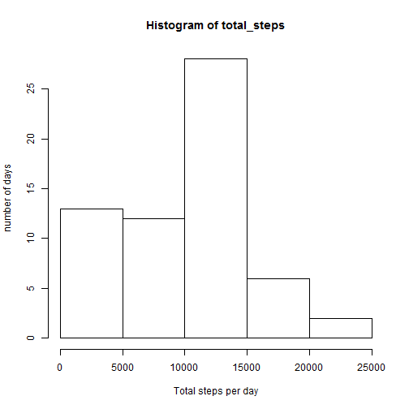
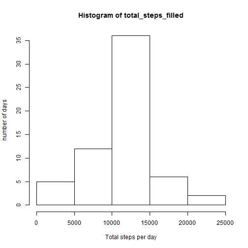
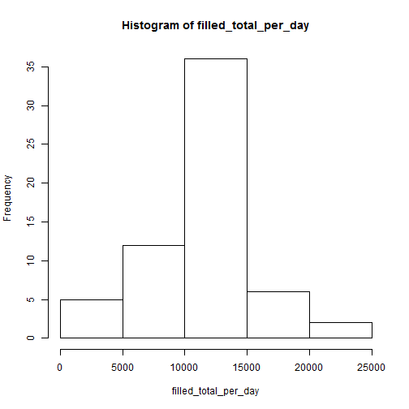
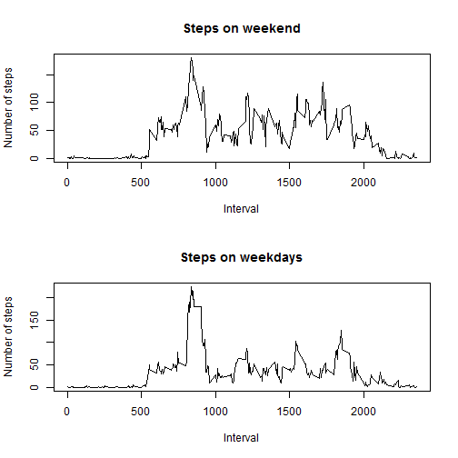

Course Project 1 - Samuel Kilchenmann
===

# Loading and preprocessing the data
Download, unzip and read the data.The data is downloaded into a temporary file, that is then unziped and the csv file contained in the zip file is read in.


```r
temp <- tempfile()
download.file("https://d396qusza40orc.cloudfront.net/repdata%2Fdata%2Factivity.zip",temp)
data <- read.csv(unz(temp, "activity.csv"))
unlink(temp)
```

#What is mean total number of steps taken per day?
Format the date column and sum the steps for each day. Putting out the result as a histogram.


```r
data$date<-as.Date(data$date)
total_steps<-tapply(data$steps,data$date,sum, na.rm = TRUE)
 hist(total_steps, xlab="Total steps per day",ylab="number of days")
```



Calculate the mean and median of the total number of steps taken per day.


```r
mean_steps<-mean(total_steps)
mean_steps
```

```
## [1] 9354.23
```

```r
median_steps<-median(total_steps)
median_steps 
```

```
## [1] 10395
```

#What is the average daily activity pattern?
Calculate the average numer of steps for each interval and plot the number of steps over the timeframe of the average day.


```r
step_per_int<-tapply(data$steps,data$interval,mean, na.rm = TRUE)
plot(rownames(step_per_int),step_per_int,type="l", xlab="Interval", ylab="Number of steps")
```


Extracting the interval with the maximum number of steps on an average day.


```r
names(which.max(step_per_int))
```

```
## [1] "835"
```

Calcculate the number of NA values


```r
sum(is.na(data$steps))
```

```
## [1] 2304
```

#Imputing missing values
Filling in the missing values. In order to deal with missing values, we fill the gaps, by filling the gaps with the average steps that are taken during this interval.


```r
data_filled<-data
data_filled[is.na(data_filled)]<-step_per_int
total_steps_filled<-tapply(data_filled$steps,data_filled$date,sum)
 hist(total_steps_filled, xlab="Total steps per day",ylab="number of days")
```


 

```r
 filled_total_per_day<-tapply(data_filled$steps, data_filled$date,sum)
 hist(filled_total_per_day)
```


 Calculate the mean and median values of the total steps taken per day.
 

```r
 mean(filled_total_per_day)
```

```
## [1] 10766.19
```

```r
 median(filled_total_per_day)
```

```
## [1] 10766.19
```

It can be seen that the filling of the missing values did affect the mean and median of the total steps that were taken each day, as we add in additional values that sum up.

#Are there differences in activity patterns between weekdays and weekends?

Create a new factor variable that indicates if a day is weekend or weekday.


```r
weekdays1 <- c('Montag', 'Dienstag', 'Mittwos', 'Donnerstag', 'Freitag')
data$weekday <- factor((weekdays(data$date) %in% weekdays1), levels=c(FALSE, TRUE), labels=c('weekend', 'weekday'))
steps_WE_WD <- with(data, tapply(steps, list(interval, weekday), mean, na.rm=TRUE))

par(mfrow=c(2,1))
plot(rownames(steps_WE_WD),steps_WE_WD[,1],type="l", xlab="Interval", ylab="Number of steps", main = "Steps on weekend")

plot(rownames(steps_WE_WD),steps_WE_WD[,2],type="l", xlab="Interval", ylab="Number of steps", main = "Steps on weekdays")
```



The plots show that the step pattern differ on the weekend and the weekday, while on the weekend, the days are more uniformly distributed, on the weekdays, a peak is observable in the morning.
